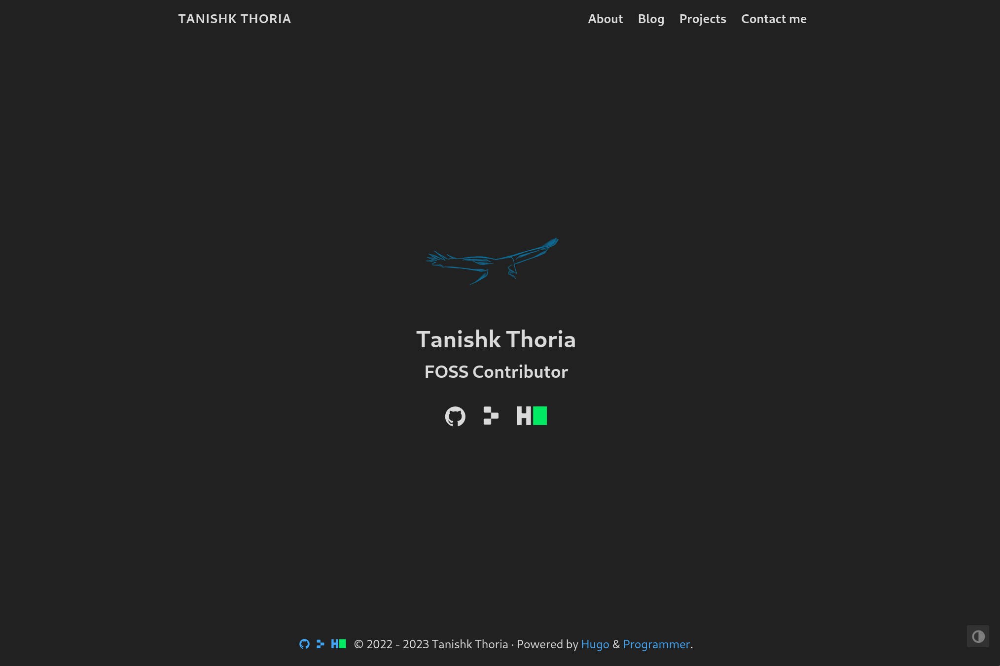

<div>

<p> 
  <h1>Hugo-Programmer</h1> 

  <a href="https://github.com/TanishkThoria/Hugo-Programmer/commits/main"> 
     
  </a> 

  <br/>

  <a href="https://github.com/TanishkThoria/Hugo-Programmer/blob/main/LICENSE">
    
  </a>
</p>

</div>

# 



A sleek and minimal theme for [Hugo](https://gohugo.io), an efficient and easy to use tool for creating websites.
<br/>
*This theme is a modified version of the [Hugo Coder](https://themes.gohugo.io/themes/hugo-coder/) theme.*

# Example Site
Can't decide if you like it or not? You can find a [live demo](https://tanishkthoria.netlify.app) of this theme. 
<br/>
If you like what you see or are looking for what to do next, you can find the [`source code`](https://github.com/TanishkThoria/Personal-Website) of this demo.

# Starting from scratch
If you are are starting a new website from scratch, there are a couple commands you will have to do before you can add the theme.

1) First, we will need to create a new site with hugo. <br/>
```hugo new site quickstart```
2) Now, we will need to navigate into the new site that we just created. <br/>
```cd quickstart```
3) Next, we will initialize an empty git repository <br/>
```git init```

Now you can continue with the next steps in the [adding the theme](#adding-the-theme) portion

# Adding the Theme
1) This theme should be added as a submodule in your themes directory:
  ```
  git submodule add https://github.com/TanishkThoria/Hugo-Programmer.git themes/Hugo-Programmer
  ```
<br/>

2) Edit your `config.toml` file to match the new theme. You can do this by:

  - Simply adding  `theme = "Hugo-Programmer"` at the top of the file and then adding other parameters seperately.

  - Or by copying this [baseline configuration](https://github.com/TanishkThoria/Hugo-Programmer/blob/main/docs/configurations.md#complete-example) and filling it out. <br/>
    **This is the recommended option due to being mostly filled out**

  - Or by copying and editing the [example website](https://github.com/TanishkThoria/Personal-Website/blob/main/config.toml). <br/>
    *Note that some of the images in the example website may not load properly in your website due to them being relative links.*
    *This could be fixed by either locally downloading the same images or adding*
    ```https://tanishkthoria.netlify.app/```
    *in front of all relative links.*


3) You should be good to go! To display the current version of the website *including drafts**, execute the following command:
  ```
  hugo server -D
  ```
  or just `hugo server` if you do not want to display drafts (This is how the website would look like if published).

  The resulting site will be displayed at `http://localhost:1313/`

  *drafts of blog posts

<br/>

# Modifications
Wonder what is different from the original Hugo-Coder theme?

This theme:
- Supports custom images for socials (non-Font Awesome)
- Added socials to footer
- More attractive blog posts page
	- Supports image thumbnails
	- Categorizations shown when in list-view
	- Descriptions shown when in list-view
	- Tags shown when in list-view
## Currenly working on:
- Modifying the posts page

<br/>

# Need help?
Documentation can be found under the [`docs`](https://github.com/TanishkThoria/Hugo-Programmer/tree/main/docs/home.md) folder.

Feature requests and issues can be reported through [Github's Issues](https://github.com/TanishkThoria/Hugo-Programmer/issues)

Further questions can be email to me at tanishkthoria@gmail.com 

<br/>

# Licensing
This theme, as well as the theme is forked from, is licensed under the [MIT License](https://github.com/TanishkThoria/Hugo-Programmer/blob/main/LICENSE)

<br/>

# Have a great day :)
